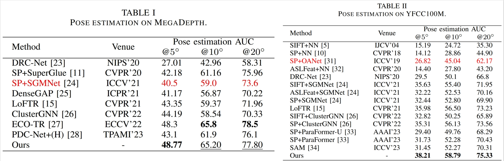

# Beyond Global Cues: Unveiling the Power of Fine Details in Image Matching

### Introduction
The official code of our ICME 2024 paper.

### Dependencies
* Python 3 = 3.8.12
* PyTorch = 1.9.1

### Run the demo of our method
```sh
python  ./demo.py
```
The default will resize images to `640x640`.

### Weights

Weights can be found [here](https://pan.baidu.com/s/1W-Ame3A3s378JKSB2bOjNw?pwd=38n7)

### Data preparation

For details of data preparation, please refer to [this](https://github.com/HUSTNO1WXY/FineFormer/blob/main/docs/TRAINING.md).

### Evaluation on MegaDepth
```shell
# with shell script
bash ./scripts/reproduce_test/outdoor_ds.sh
```

you can reproduce results in paper, namely,
```txt
AUC@5    AUC@10  AUC@20  Prec
48.77    65.20   77.80   97.29 
```

### Evaluation on YFCC100M
For the script for evaluation on YFCC100M, you can refer to [superglue](https://github.com/magicleap/SuperGluePretrainedNetwork).

When the RANSAC threshold is set to 1.0, you can reproduce results in paper.

After preparing the code for release, we tuned the hyperparameters and made some improvements. For example, when the RANSAC threshold is set to 0.3, the performance of our proposed method can be boosted again:
```txt
Evaluation Results (mean over 15 pairs):
AUC@5    AUC@10  AUC@20  Prec
42.55    61.69   76.75   93.87 
```

### About training

If you want to train yourself, please
```sh
python  ./train.py
```

Due to the limited computational resources, the images are resized to `640x640` during training. You are suggested to use the larger sizes since many works have proven that the large sizes can improve the performance.

### A note on correction
<details>
  <summary>[Click to expand]</summary>
  
In Table 1 and Table 2, the AUC scores for some entries are repeated. The same story goes for our [another work](https://ieeexplore.ieee.org/document/10485434). Here we make the correction (shown in red):

<p align="center">
  
</p>

Notice that this is just a copy/paste mistake and has no influence about evaluation and conclusions of our papers.
</details>

### Citation
If you use any ideas from the paper or code from this repo, please consider cite our paper through IEEE Xplore.
